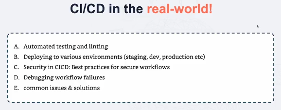
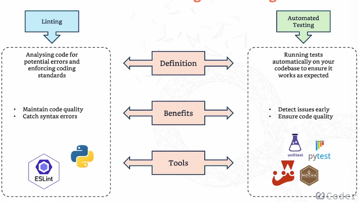

# **CI/CD in the real-world**

**Automated testing and linting**
---
- **Linting and automated testing** help us catch errors early and keep our codebase clean and reliable.

- **Linting:** A process of analyzing your code for any **syntax errors, bugs, and deviations,** it's like having a spell checker for your code. 

- **Automated testing:** The practice of running tests on your codebase automatically to ensure it works as expected. It involves writing test cases/apps that **verify different parts of your code** and running these tests automatically every time you make changes to the code. (e.g. python unittests)

- **Tools:** ESLint, PyLint, Unittest, Pytest etc 

**Deploying to different enviroments**
---
- When working in a real environment, we typically deploy to 3 or 4 environments: **Development, Staging, and Production.**

- **Can be done in two ways:** **Manual** (moving code manually between environments) or **Automated** (uses scripts and tools to move code between environments)

- Automated = **faster, more reliable and less prone to human error**

- **Tools to manage deployment:** AWS, Azure. GCP

**Best Practices for Secure Pipelines**
---
- **Secure your secrets:** Never hard-code sensitive information like **API keys, passwords, or tokens in your code.** Use GitHub Secrets or dedicated secret-management tools to store and access them securely, preventing accidental exposure.

- **Control access:** Apply the principle of least privilege by giving users **only the permissions they need.** Use role-based access control (RBAC) to reduce the risk of unauthorized access or accidental changes.

- **Scan for vulnerabilities:** Regularly scan your code and dependencies using tools like **Dependabot, Snyk, or similar security scanners.** Catching vulnerabilities early helps prevent security breaches.

- **Audit and monitor:** Enable **logging, auditing, and monitoring for your CI/CD pipelines.** Track actions, watch for suspicious behavior, and **set up alerts** so potential security incidents are detected and handled quickly.
