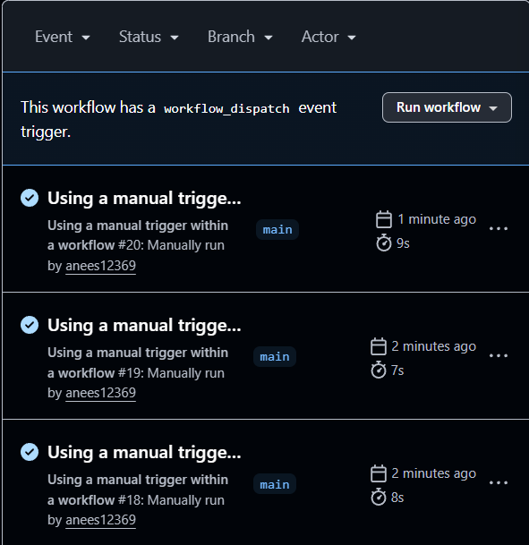

# **Manual Triggers**

- Manual triggers in GitHub Actions allow you to run a workflow **manually on GitHub**, instead of automatically running it on events like **push or pull request**

- Enabled using the `workflow_dispatch` event in GitHub Actions.

**For example:**

```yaml
on:
  workflow_dispatch:
    inputs:
      environment:
        description: "Deployment environment"
        required: true
        default: "staging"

# Instead of:
 on: [push]

```
**Why are manual triggers used?**
---
- Run workflows on demand

- Add human control for important tasks like **production deployments**

- Safely perform maintenance or one-off jobs

- Debug and test workflows when needed


