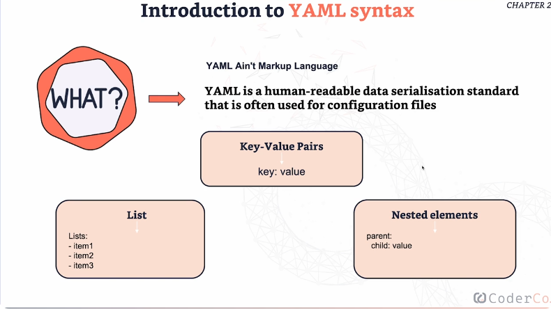

# **What is YAML?**

- YAML stands for “YAML Ain’t Markup Language.”

- It’s a **human-readable format used to write configuration files.**

- YAML is very important in DevOps and is used in tools like CI/CD pipelines, GitHub Actions, Kubernetes, and more.

**Why YAML is used:**
---

- Easy to read and write, uses indentation instead of symbols, great for defining steps, settings, and workflows

**3 Core YAML Concepts:**
---

