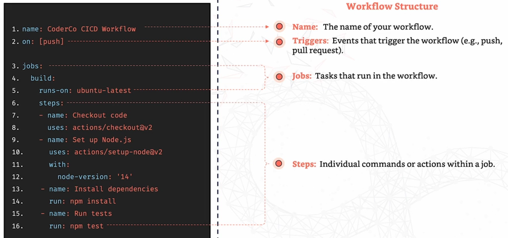
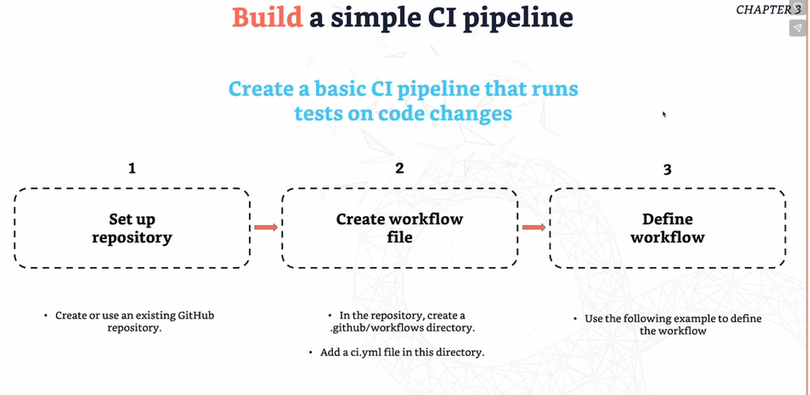

# **Workflow Syntax and Structure**

- A workflow is defined in a YAML file and is usually located in the `.github/workflows`. 

- Any workflow that you have, in a YAML file,  is triggered by GitHub **as a pipeline**.

**What is the structure of a workflow?**
---

- `runs-on` specifies the virtual machine that the job will run on (Ubuntu, Windows, macOS) 

- `Jobs` an run parallel or sequentially 

- `steps` Individual tasks executed in order

- `uses/run` The action/command that will be executed within a job

