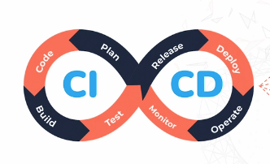

# **What is CI/CD?**

- It helps us build, test, and release software applications much faster and much more reliably.

**What is Continuous Integration?** 
---
- Developers write and commit code frequently (GitHub, GitLab, Bitbucket, etc.).

- This code is automatically built, ensuring it compiles and all dependencies are included.

- Automated tests check for bugs and issues early.

**What is Continuous Deployment/Delivery** 
---
- **Continuous Delivery:** Code that is built is ready for **manual deployment** if it passes checks 

- **Continuous Deployment:** Code that is built is **automatically deployed** if it passes checks 

**How does it work?**
---
**1. Code Commit**

- A developer makes changes to the code. The changes are committed and pushed to the repository.

**2. Build Trigger**

- That commit automatically triggers the pipeline.

**3. Build**

- The code is compiled (converted into something the computer understands). 

- All required dependencies are assembled through libraries/frameworks 

- The team is notified whether the build succeeds or fails.

- *“Build” simply means: Turning your written code into something that can actually run and be deployed.*

**4. Automated Testing**

- Automated tests run to make sure the new changes don’t break existing features. Test results are shared with the team.

**5. Staging Deployment**

- If tests pass, the build is deployed to a staging environment. This is used for further testing and validation.

**6. Production Deployment**

- Once everything looks good, the code is deployed to production. Users can now access the new changes.

**Why CI/CD Is Important**
---

- **Automation:** Automation lets teams release features and fixes much faster.

- **Continuous Feedback:** Bugs are caught early through continuous testing.

- **Reduced risk:** Small, frequent changes are easier and safer to deploy.

- **Better collaboration:** Frequent integration means fewer conflicts and better teamwork.

- **Consistency:** Ensure code works the same in all environments 

