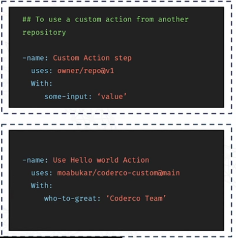

# **Custom Actions**

**What are Custom Github Actions?**
---
- Custom actions are a fantastic way to automate parts of your workflow that are **specific to your project**

- They're **reusable units of code** that **automate specific tasks** in your CI/CD pipeline and can be used in **multiple workflows**

- You can create these actions in **JavaScript, Docker, or even as a composite action.**

**How do you create one?**
---
1️⃣ Create a new GitHub repo
2️⃣ Add an `action.yml` file
3️⃣ Write the action logic (JS / Docker / YAML)
4️⃣ Commit and tag a release (v1, v1.0.0)
5️⃣ (Optional) Publish to GitHub Marketplace

**Benefits of custom actions**
---
- **Consistency:** Ensures all repositories follow the same CI/CD steps and quality checks, reducing errors and making workflows predictable.

- **Efficiency:** Saves time and effort by creating automation once and reusing it across multiple projects.

- **Maintainability:** You can update the action in one place rather than fixing multiple workflows across repositories.

- **Scalability:** Makes it easy to scale CI/CD practices without increasing complexity.

**How to use a custom action from another repo:**
---

- Or it can be used locally, by referencing the path 